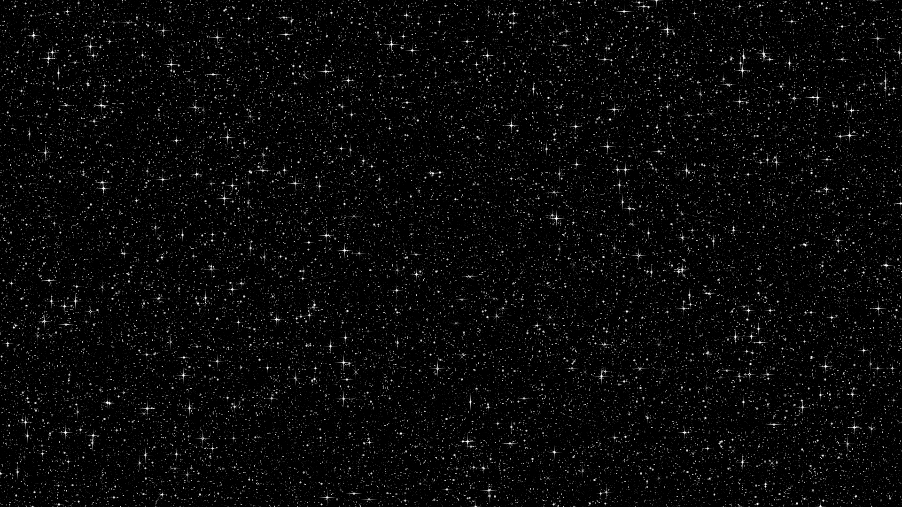
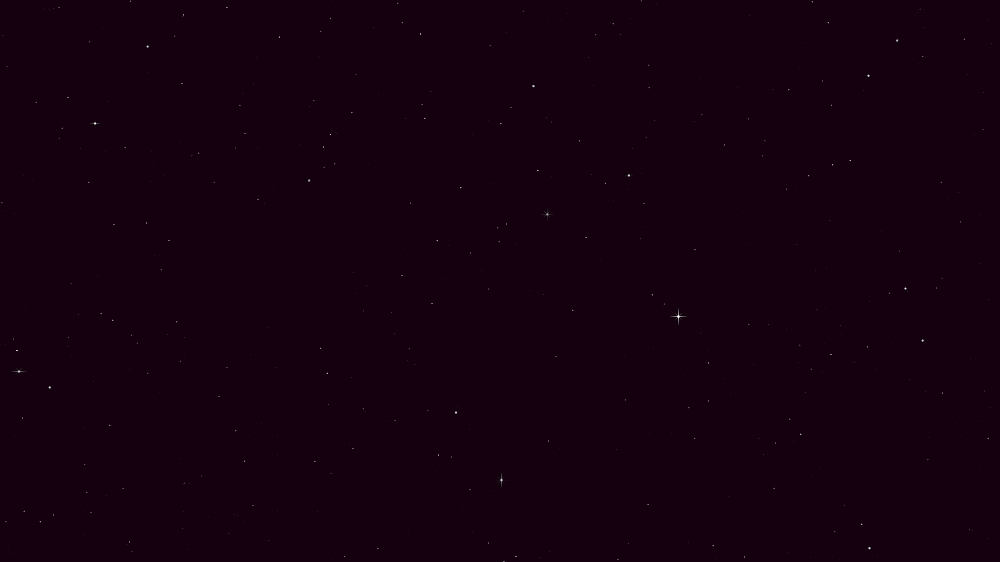
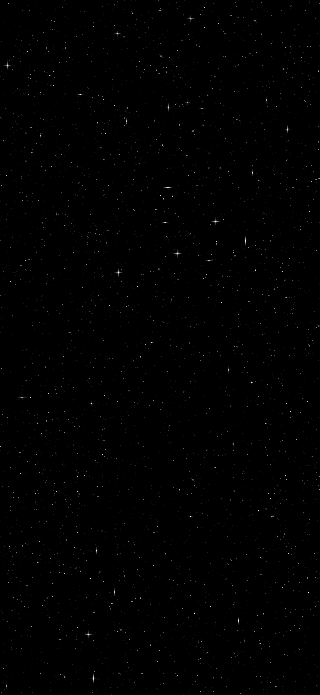

# Starfield Generator

CLI tool that generates starfield images.

## Installation

```bash
pip install -r requirements.txt
python starfield.py [OPTIONS]
```

## Options

- `-s, --size SIZE`: Image size in pixels (format: WIDTHxHEIGHT or WIDTH:HEIGHT)
  - Default: `1920x1080`
  - Example: `1920x1080` or `1920:1080`

- `-d, --density DENSITY`: Ratio of star pixels to total pixels (0.0-1.0)
  - Default: `0.05`
  - Example: `0.03` for sparser starfield, `0.1` for denser

- `-b, --background BACKGROUND`: Background color (hex) or image path
  - Default: `#000000` (black)
  - Hex example: `#001122` (dark blue)
  - Image example: `nebula.jpg`

- `-o, --output OUTPUT`: Output file path
  - Default: `starfield.png`

## Examples:

Here's an image generated with the default settings:



This sparse image was generated with `-s 1920x1080 -d 0.0005 -b "#150010"`, which produces a sparser field and varies the background.



This image was generated with `-s 1179x2556 -d 0.005`, to make a mobile phone background.




